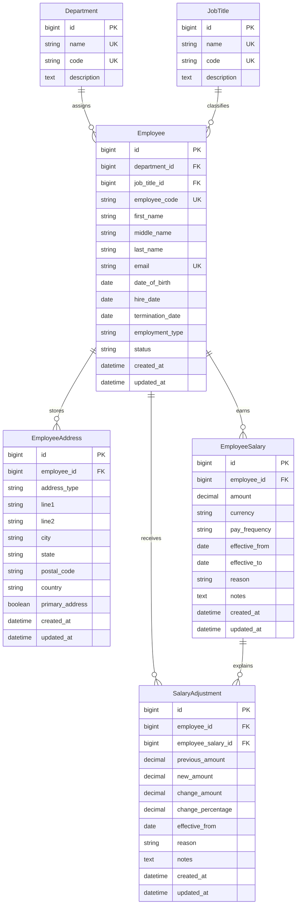

# ER Diagram

This diagram covers the core payroll domain models used by the application.

## Domain Summary

- `Department` and `JobTitle` are reference tables
- `Employee` is the central entity for identity and employment state
- `EmployeeAddress` stores address and country details
- `EmployeeSalary` stores salary records over time
- `SalaryAdjustment` records explicit salary change events against a salary row

## Diagram

## Relationship Notes

- A `Department` can have many employees
- A `JobTitle` can have many employees
- An `Employee` can have many addresses, but the database enforces at most one primary address
- An `Employee` can have many salary rows across time
- A `SalaryAdjustment` belongs to both an employee and a specific salary row
- The UI primarily works with an employee's current address and current salary
